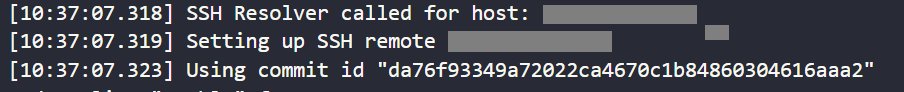
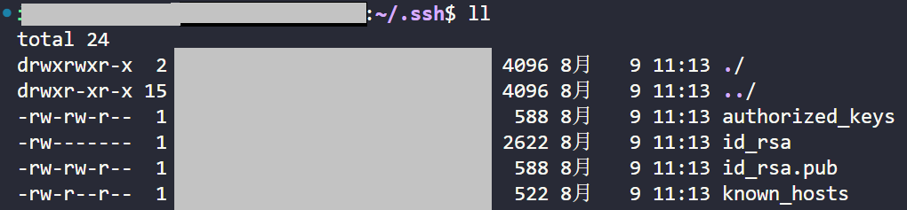

### 一、SSH 相关

#### 1、vscode 更新后导致 ssh 连接失败

解决方法：

1. 记下 ssh 连接失败的 log信息中的 **commit id**
   
   
2. 使用终端工具 ssh 远程连接，进入目录 **~/.vscode-server/bin**，删除上述步骤中 commit id 对应的文件夹，若删除需要 root 权限，可先进入 docker 获取 root 权限然后再删除（**注意是在远程 linux 机器上操作，而不是本地 windows**）

#### 2、vscode ssh 免密登录

1. **本地 windows** 生成 SSH key：`ssh-keygen -t rsa` ，之后将本地 key 拷贝到远程机上，多个机器共用一套密码，包括之后 Gitlab 中使用的 key 也是这个
2. 将本地 key 拷贝到远程机上，使用 scp 命令，尽量直接拷贝整个 .ssh 文件（文件权限问题）：`scp -r C:\Users\[Username]\.ssh  [Username]@10.9.XX.XX:/home/[Username]`
3. 打开远程机进入 .ssh 目录，之后 `cat id_rsa.pub >> authorized_keys` 生成验证文件
4. （可选）本地机器 ssh config 好像不添加配置项也可以用（`IdentityFile "C:\Users\[Username]\.ssh\id_rsa"`）

备注：免密登录失败一般都是目录和文件权限不对，如果远程机从来没有 .ssh 文件夹，本地机器直接拷贝过去，是不会出现权限问题的。如果远程机之前有 .ssh 文件夹，即使删除掉也可能会出现权限问题，需要参照正确权限进行修改（chmod命令）。目录和文件权限参考如下，重点是 id_rsa 文件的权限应为600（否则使用 ssh 连接 git 时也会提示权限 too open）：

​        

### 二、Docker 相关

#### 1、Remote - Containers 插件

- VScode 中的 Remote - Containers 插件可以直连 docker 容器，开发更加方便

#### 2、docker 容器中的 ubuntu 系统升级（16.04 →18.04 → ...）

1. 添加 apt 源，`vim /etc/apt/sources.list`

   **ubuntu 16.04 apt 源**

   ```bash
   deb-src http://archive.ubuntu.com/ubuntu xenial main restricted #Added by software-properties
   deb http://mirrors.aliyun.com/ubuntu/ xenial main restricted
   deb-src http://mirrors.aliyun.com/ubuntu/ xenial main restricted multiverse universe #Added by software-properties
   deb http://mirrors.aliyun.com/ubuntu/ xenial-updates main restricted
   deb-src http://mirrors.aliyun.com/ubuntu/ xenial-updates main restricted multiverse universe #Added by software-properties
   deb http://mirrors.aliyun.com/ubuntu/ xenial universe
   deb http://mirrors.aliyun.com/ubuntu/ xenial-updates universe
   deb http://mirrors.aliyun.com/ubuntu/ xenial multiverse
   deb http://mirrors.aliyun.com/ubuntu/ xenial-updates multiverse
   deb http://mirrors.aliyun.com/ubuntu/ xenial-backports main restricted universe multiverse
   deb-src http://mirrors.aliyun.com/ubuntu/ xenial-backports main restricted universe multiverse #Added by software-properties
   deb http://archive.canonical.com/ubuntu xenial partner
   deb-src http://archive.canonical.com/ubuntu xenial partner
   deb http://mirrors.aliyun.com/ubuntu/ xenial-security main restricted
   deb-src http://mirrors.aliyun.com/ubuntu/ xenial-security main restricted multiverse universe #Added by software-properties
   deb http://mirrors.aliyun.com/ubuntu/ xenial-security universe
   deb http://mirrors.aliyun.com/ubuntu/ xenial-security multiverse
   ```

2. 安装升级包：`apt install update-manager-core`，这样就可以使用 do-release-upgrade 命令了

3. 执行 `do-release-upgrade` 命令

### 三、Git 相关

#### 1、git config

```bash
git config --global user.email xxx@qq.com
git config --global user.name fjlp521
git config --global core.quotepath false	#解决命令终端git中文显示问题
git config --global core.editor vim			#设置编辑器为vim
#针对某一特定仓库，可单独设置用户
git config --local user.email xxx@qq.com
git config --local user.name fjlp521
```

注：建议采用 ssh key 方式连接 git，采用 https 的方式还得额外配置 token

#### 2、连接远程仓库

```bash
git init  #生成本地仓库
git remote add origin git@github.com:fjlp521/Work.git  #添加远程仓库，origin为远程仓库名字，可以随意起，后面链接采用ssh形式
git branch --set-upstream-to=origin/master master  #将本地分支和远程分支相关联，提交时可以直接 git push，否则得用 git push -u origin master
```

注意：新建远程仓库，目前只了解到一种方法：在 Github 网站手动点击创建。猜测可能会有命令行方式创建远程仓库。。。

#### 3、git rebase：合并多次提交

目前 log 状态

```bash
commit5:update id: 555
commit4:update id: 444
commit3:update id: 333
commit2:update id: 222
commit1:update id: 111
第一次往仓库里加东西first time:add	id: 12345
```

注意：只能合并到commit1，不能合并到first time，即理想情况时最终只剩下id: 12345，但不行，最终会剩下id: 111和id: 12345

操作步骤

```bash
#step:1，以下三种均可，最后一种指不需要合并的id，即111的前一个
git rebase -i HEAD~5 || git rebase -i HEAD^^^^^ || git rebase -i 12345 

#step:2，之后会进入编辑器，显示如下
pick 111
pick 222
pick 333
pick 444
pick 555
#更改为
pick 111
s 222
s 333
s 444
s 555
#pick表示use commit，s，即squash，表示use commit但是合并到前一次中，更改后的意思即将555、444、333、222合并到111中

#step:3，如果遇到冲突，修改对应文件
git add .
git rebase --continue

#step:4，没问题的话会弹出commit message编辑页面，编辑提交信息

#step:5，强制提交
git push --force || git push -f
```

### 四、vscode 中 clangd 插件配置

1、安装插件

2、ctrl + shift + p，clangd: download language server

3、这时候可能自定义的头文件会找不到，有两种解决办法

- 第一种：在本项目中配置 .vscode > settings.json，内容如下。或者配置在 vscode 的全局 settings 中（扩展—clangd—Fallback Flags），看情况选择使用

  ```json
  {
      "clangd.fallbackFlags": [
          // 设置clangd代码检查的c++版本，目前默认是c++14
          "-std=c++2a",
          // 增加项目自身头文件依赖路劲，因为使用vs2019编译不会生成compile_command.json文件，项目自己的头文件就不会找到
          "-I${workspaceFolder}", // 项目根目录
          "-I${workspaceFolder}/include", // 第三方依赖的头文件目录
      ]
  }
  ```

- 第二种：clangd 是基于 compile_commands.json 文件来完成对项目的解析，并支持代码补全和跳转，所以要自动生成这个文件，并对 clangd 指定文件路径

  - 自动生成该文件：使用 cmake 编译时，加上：`set(CMAKE_EXPORT_COMPILE_COMMANDS ON)`

  - 对 clangd 指定文件路径：配置在 vscode 的全局 settings 中（扩展—clangd—Arguments）

    ```json
    --compile-commands-dir=${workspaceFolder}/build //cmake编译到build文件夹
    ```

    还有其他的一些配置项：

    ```json
    --completion-style=detailed //代码补全的时候完全显示函数的参数类型
    --header-insertion=never   //避免clangd自动引入一些函数依赖的头文件
    ```

4、配置完重新加载页面！配置完重新加载页面！配置完重新加载页面！

